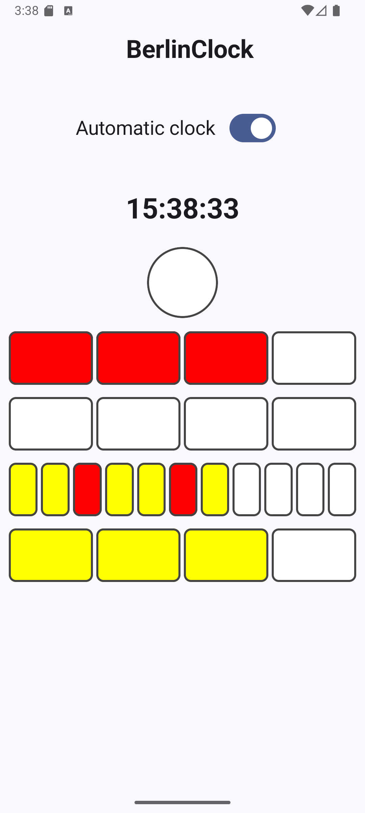
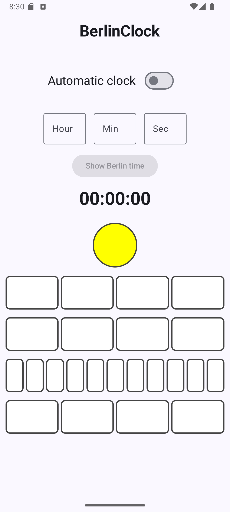
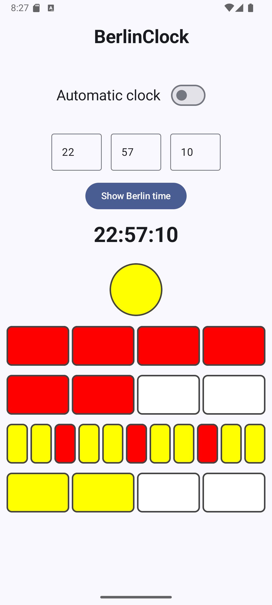

# Berlin clock

This Android app showcases the Berlin Clock, a time-telling device that utilizes a series of
illuminated colored blocks. The app is built using Clean Architecture + MVVM + TDD

This characteristic clock reads from top to bottom.

- The top big lamp - (yellow) - blinks to indicate seconds and remains illuminated only during even
  seconds.
- The first line - 4 lamps (red) - each lamp representing five hours.
- The second line - 4 lamps (red) - each lamp represents one hour.
- The third line - 11 lamps (yellow, every 3rd is red) - each lamp represents five minutes.
- The fourth line - 4 lamps (yellow) - each lamp represents one minute.

## How to run

1. In Android Studio, create a new project by selecting the "Project from Version Control" option,
   then clone the project using the following repository link.

```
   https://github.com/2O25-DEV2-002/BerlinClock.git
```

2. Once the Gradle sync is successful, proceed to run the app on either an emulator or a connected
   device. The minimum API level required is 24, and it has been tested against a device running
   Android 13.
3. You can also use the CLI to build and install the app using the following command.

```
 ./gradlew installDebug
```

## Tech Stack

- Kotlin
- Jetpack Compose
- Coroutines + Flow for asynchronous
- MVVM + Clean architecture + TDD
- Material Design 3 components
- StateFlow and ViewModel
- Hilt - Dependency Injection
- Unit tests - JUnit, MockK, Truth
- Instrumentation tests - Espresso

## Screenshots

| Automatic clock                                         | Manual clock                                          | Manual clock                                          |
|---------------------------------------------------------|-------------------------------------------------------|-------------------------------------------------------|
|  |  |  |
